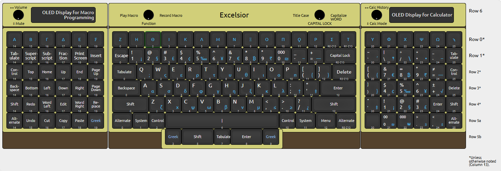

# *Excelsior*
>
>Tentative layout and design for *Excelsior*.

*Excelsior* is a 150% (153 keys) 3-section hand-wired keyboard (optionally) using uniform keycaps in a curved plate.

The main section is based on a standard ANSI 60% keyboard, but with a row of 15 function/programmable-macro keys at the top and 5 keys below the 7u spacebar.

The peripheral sections are each 6x6 ortholinear boards and can be placed on either side of the main section, including placing both on the same side of the main. They are connected to the main section by 12-pin pogo pin connectors either directly or via a custom cable. In the default keymap one section is an extended numpad and the other is a large navigation/macro pad. The top row of each peripheral is dedicated to additional function/programmable-macro keys for a total of 27.

The microcontroller is a Pimoroni PGA2350 board located in the main section. The matrix for the main section is wired directly to the controller board, while the I/O for the peripheral sections is handled by an MCP23017 I/O expander in each section communicating with the controller via I²C. The connections between the sections carry the signals necessary for both I²C and for SPI, plus several spare lines for interrupts, chip selects, or other I/O.

The matrix of the main section also has a seventh row that can be used for up to 14 momentary, toggle, or rotary switches on the top bezel of the keyboard. Note that the keys below the spacebar are on the sixth (spacebar) row of the matrix, so the seventh row is completely open.

Because of the massive number of GPIO pins on the PGA2350 and the I/O expanders, there is ample spare I/O for any functionality you could possibly want, from displays, encoders, LEDs, etc.

Because QMK does not currently support the RP2350 or displays larger than 128×64, I am planning to use KMK for the firmware.

For those interested, I have designed a [custom set](https://yuzukeycaps.com/c/4633754e-42e4-428c-9306-6221ce11477c)[^1] of KAM keycaps with a white-on-black-with-blue-accents *Wall Street Journal*-inspired aesthetic for *Excelsior* at YUZU Keycaps. They also feature secondary legends for a Greek alphabet/symbol layer and the macro keys are labeled with Greek numerals. There are a number of extra keys for alternative layouts too. Since the keycaps have a uniform profile any key can be placed on any row.

[^1]: If the link does not work, you can import [this JSON file](keycaps/Excelsior.json) to YUZU